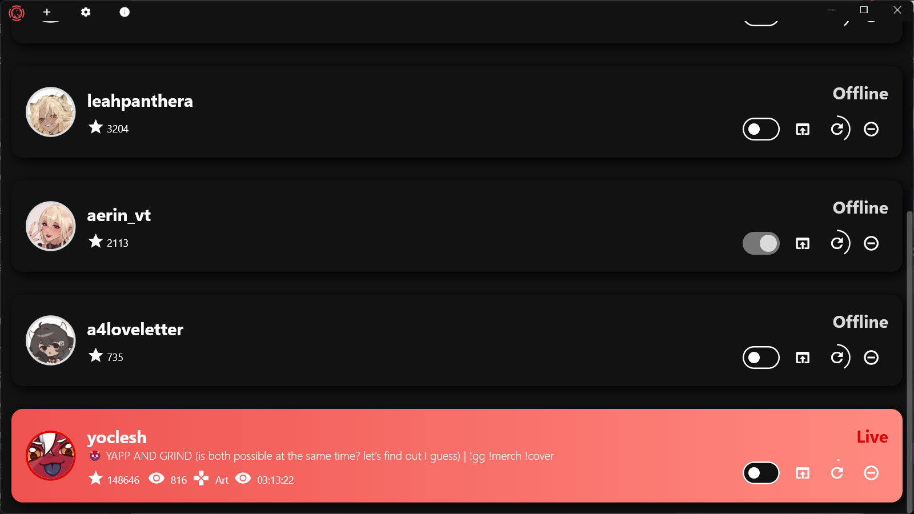

    

<h1 align="center">
Nokulive
</h1>

Nokulive is a simple app made in Flutter that allows you to see the state of all your favorite Twitch streamers, as well as to open the stream automatically to make sure you never miss a stream.

Tired of Twitch not notifying you about your favorite streamer going live? Ever missed a stream because you got too zoned in on your work and didn't realize they were live? Well, don't worry about that any more with Nokulive!

## Showcase

    
     
     
    
     
     
    

